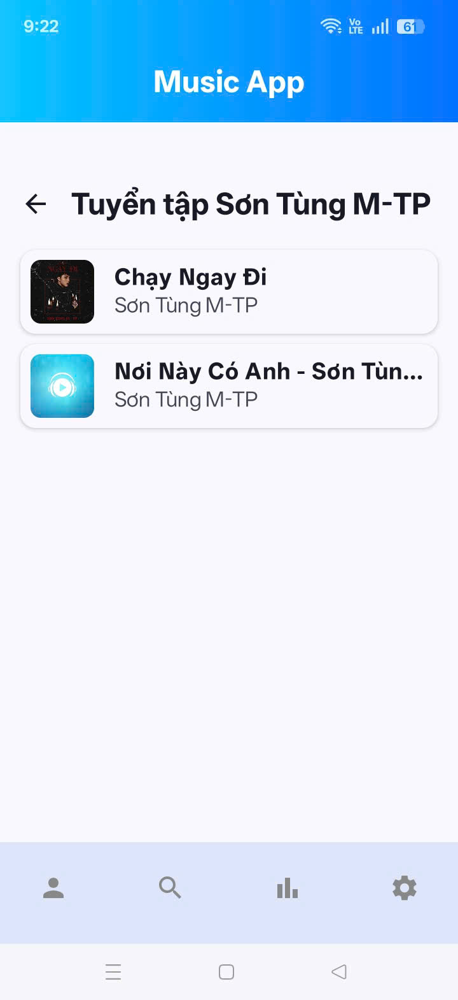

🎵 Music App - Ứng dụng Nghe nhạc

Ứng dụng nghe nhạc online và offline, được thiết kế để học thêm kiến thức và ứng dụng các kiến thức đã học

🛠 Công nghệ sử dụng
* **Ngôn ngữ & Nền tảng:** Kotlin, Coroutines, Flow
* **Giao diện (UI):** Jetpack Compose (Material 3), Navigation Compose
* **Kiến trúc:** MVVM
* **Media & Image:** Media3 (ExoPlayer), MediaSessionService, Coil
* **Networking:** Retrofit, Gson
* **Local Storage:** Room Database, Preferences DataStore
* **Dependency Injection:** Hilt

✨ Chức năng
* **Trình phát nhạc:** Phát nền liền mạch, tự động chuyển bài, hỗ trợ MiniPlayer vuốt để tắt và điều khiển qua màn hình khóa
* **Quản lý nhạc trong thiết bị:** Quét, hiển thị file MP3 có sẵn và tự động gom nhóm thành Album theo tên nghệ sĩ
* **Khám phá nhạc trực tuyến:** Tìm kiếm bài hát toàn cầu, hiển thị bảng xếp hạng (Charts) theo thể loại
* **Quản lý thư viện cá nhân:** Lưu bài hát yêu thích, xem lịch sử nghe nhạc và thao tác thêm/sửa/xóa Playlist
* **Xử lý sự kiện phần cứng (Tai nghe):** Tự động dừng nhạc ngay lập tức khi người dùng rút tai nghe
* **Tùy chỉnh cá nhân hóa (Settings):** Hẹn giờ tắt nhạc (Sleep Timer), Dark/Light Mode, đổi ngôn ngữ (EN/VI)

📱 Demo Dự Án

  
  
  
  
  
  
  
  
  
  
  
  
  
  

