# 🎵 Music App - Ứng dụng Nghe nhạc Android Hiện đại

Một ứng dụng nghe nhạc trực tuyến và offline đầy đủ tính năng, được xây dựng bằng **Android Jetpack Compose**, tuân thủ nghiêm ngặt các nguyên lý **Clean Architecture** và mô hình **MVVM**.

## 📱 Ảnh chụp màn hình (Screenshots)

  
  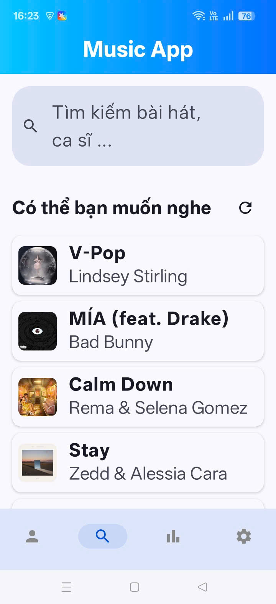
  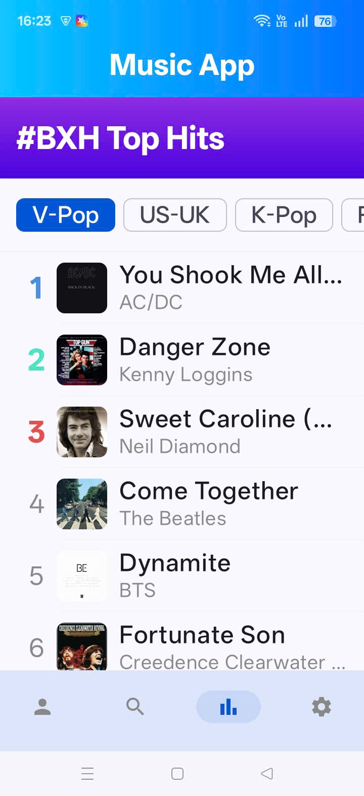
  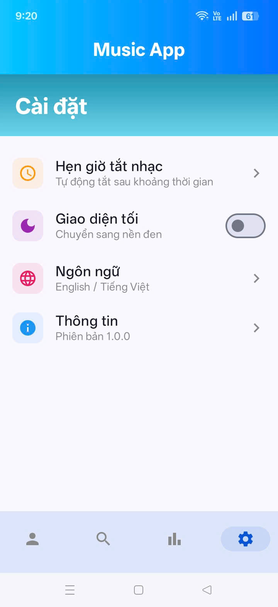
  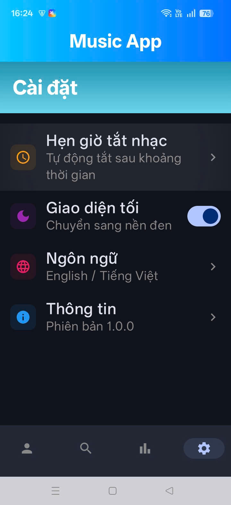
  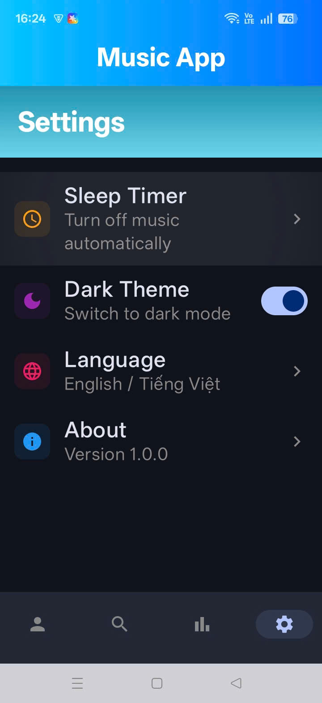
  
  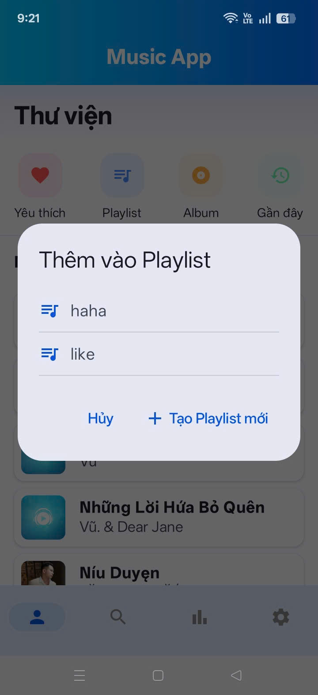
  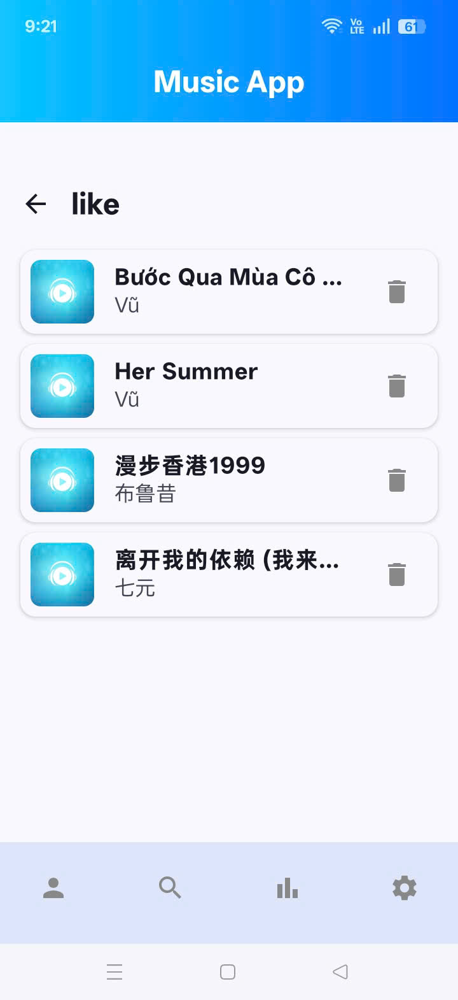
  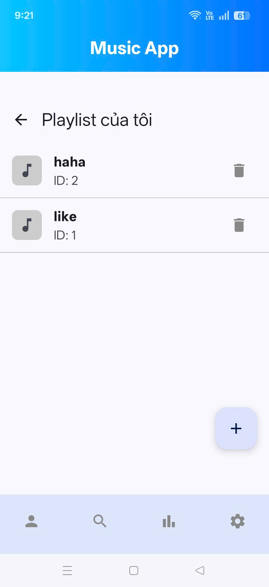
  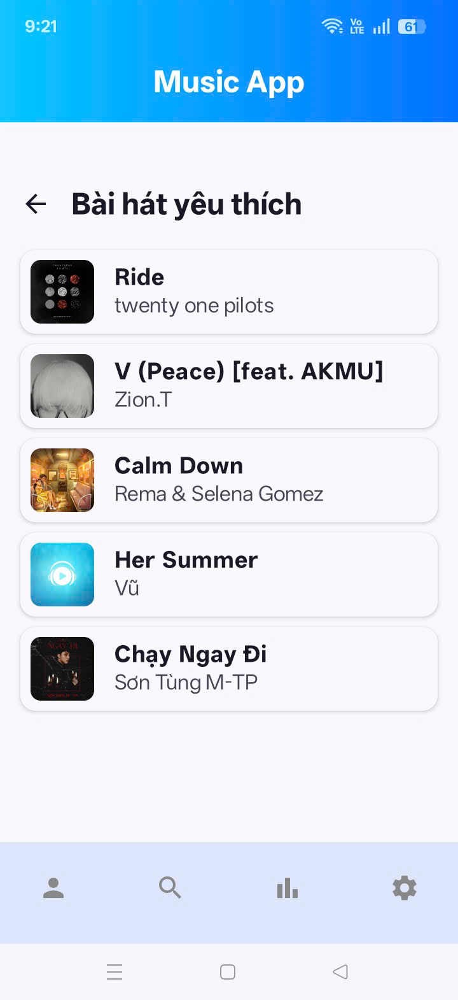
  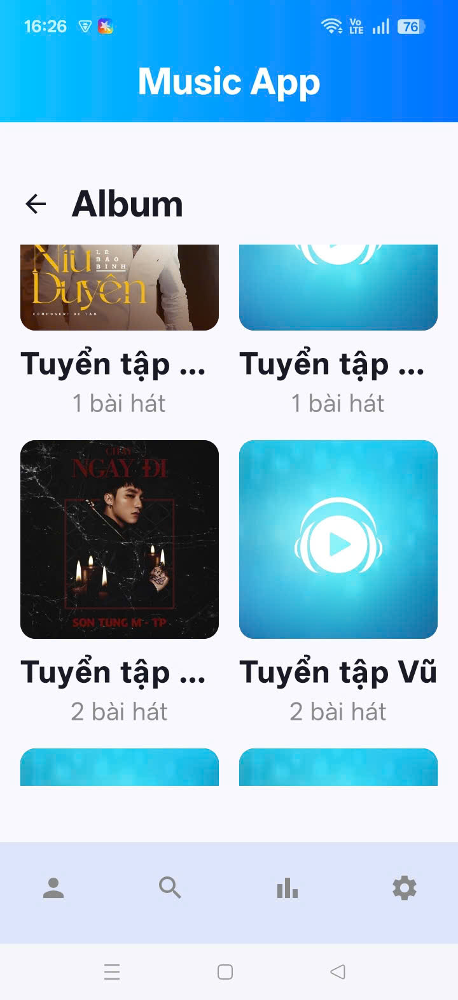
  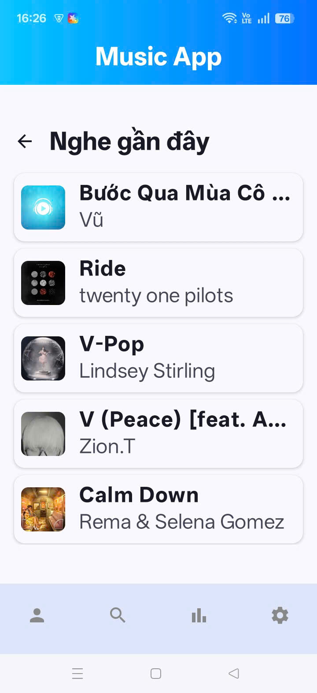

## ✨ Tính năng nổi bật

### 🎧 Trình phát nhạc cốt lõi
* **Phát nhạc đa nguồn**: Hỗ trợ phát liền mạch cả nhạc có sẵn trong máy (Local MP3) và nhạc trực tuyến (Online Streams).
* **Phát nền (Background Playback)**: Nhạc vẫn tiếp tục phát khi thu nhỏ ứng dụng hoặc tắt màn hình (Sử dụng Foreground Service & MediaSession).
* **MiniPlayer thông minh**: Trình phát thu nhỏ nổi trên màn hình, hỗ trợ thao tác vuốt sang trái để tắt nhạc.
* **Điều khiển màn hình khóa**: Tích hợp đầy đủ nút điều khiển trên thanh thông báo và màn hình khóa.

### 📂 Quản lý thư viện
* **Quét nhạc tự động**: Tự động tìm file âm thanh trong máy và lọc bỏ các file rác (< 30 giây).
* **Gom nhóm thông minh (Smart Grouping)**: Tự động gom các bài hát lẻ thành "Album ảo" theo tên Ca sĩ (Artist).
* **Playlist**: Tạo mới, đổi tên và xóa Playlist cá nhân.
* **Yêu thích & Lịch sử**: Lưu bài hát yêu thích và tự động lưu lại lịch sử các bài vừa nghe.

### 🌐 Khám phá trực tuyến
* **Tìm kiếm mạnh mẽ**: Tích hợp **iTunes API** để tìm kiếm nhạc online chất lượng cao.
* **Bảng xếp hạng (Charts)**: Các Playlist Top Hits được phân loại theo vùng/thể loại (V-Pop, US-UK, K-Pop, Rap Việt...).

### ⚙️ Cài đặt & Giao diện
* **Hẹn giờ tắt nhạc**: Đếm ngược thời gian để tự động dừng phát nhạc (Sleep Timer).
* **Giao diện Sáng/Tối**: Hỗ trợ Dark Mode/Light Mode (Lưu trạng thái bằng DataStore).
* **Đa ngôn ngữ**: Hỗ trợ Tiếng Việt và Tiếng Anh.
* **UI Hiện đại**: Hiệu ứng nền Gradient, chữ chạy (Marquee text) và thiết kế chuẩn Material 3.

## 🛠 Công nghệ & Thư viện sử dụng

Dự án được xây dựng dựa trên các tiêu chuẩn phát triển Android hiện đại nhất:

* **Ngôn ngữ**: Kotlin
* **UI Framework**: [Jetpack Compose](https://developer.android.com/jetpack/compose) (Material 3)
* **Kiến trúc**: Clean Architecture (Presentation, Domain, Data layers) + MVVM Pattern.
* **Dependency Injection**: [Hilt](https://dagger.dev/hilt/)
* **Xử lý bất đồng bộ**: Coroutines & Flow.
* **Network**: [Retrofit](https://square.github.io/retrofit/) & Gson.
* **Cơ sở dữ liệu**: [Room Database](https://developer.android.com/training/data-storage/room).
* **Lưu trữ cục bộ**: [DataStore](https://developer.android.com/topic/libraries/architecture/datastore)
* **Media Player**: [Media3 (ExoPlayer)](https://developer.android.com/media/media3).
* **Tải ảnh**: [Coil](https://coil-kt.github.io/coil/).

## 🏗 Cấu trúc dự án

com.example.musicapp

├── data                               
│   ├── local                          
│   │   ├── dao                         
│   │   ├── db                          
│   │   └── source                      
│   ├── remote                          
│   │   ├── api                         
│   │   └── dto                        
│   └── repository                     
├── di                                  
├── domain                             
│   ├── model                          
│   └── repository                     
├── receiver                            
├── service                             
├── ui                                  
│   ├── components                                 
│   ├── navigation                     
│   ├── player                          
│   ├── screens                         
│   ├── theme                           
│   └── viewmodel                       
├── utils                               
├── MainActivity.kt                     
└── MySoundApplication.kt               

## ✍️ Tác giả

* **Nguyễn Việt Anh** 
* Email: vietanhnek04@gmail.com
